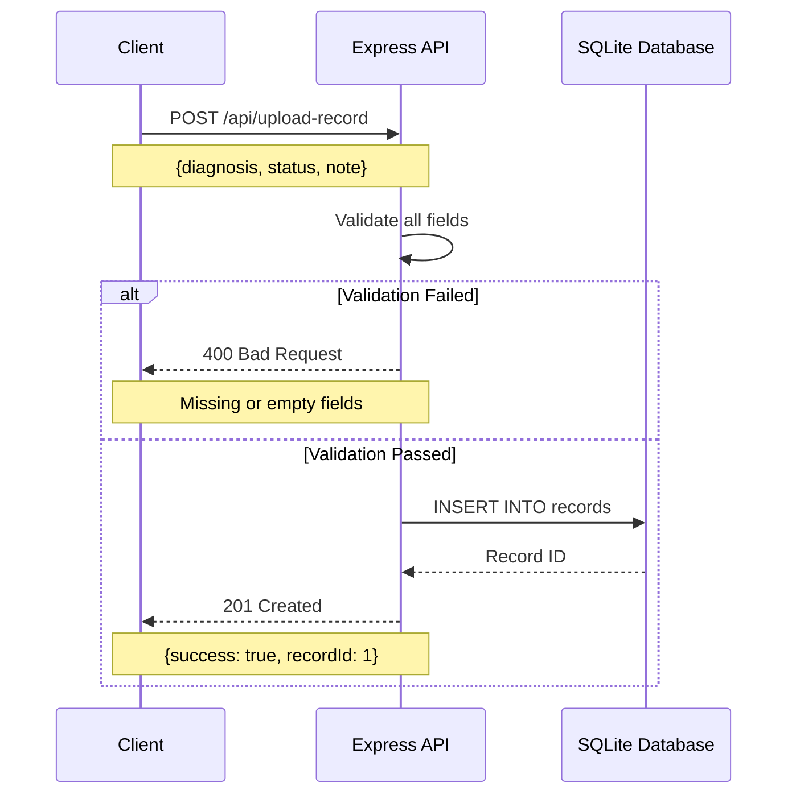
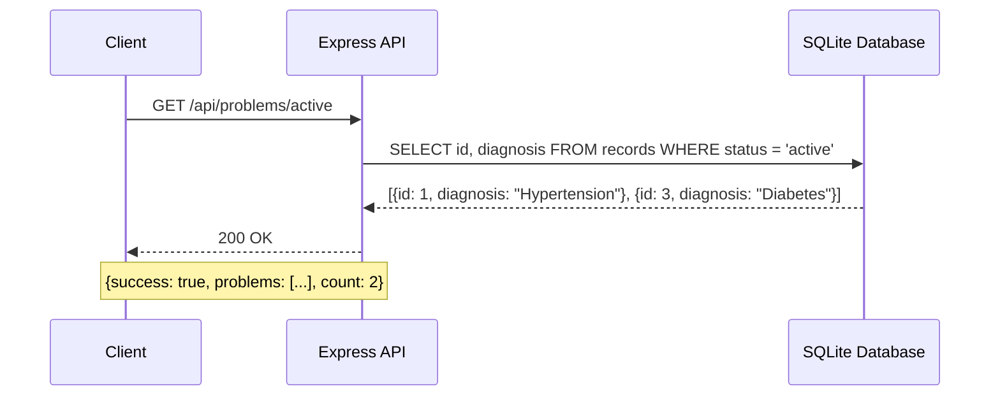
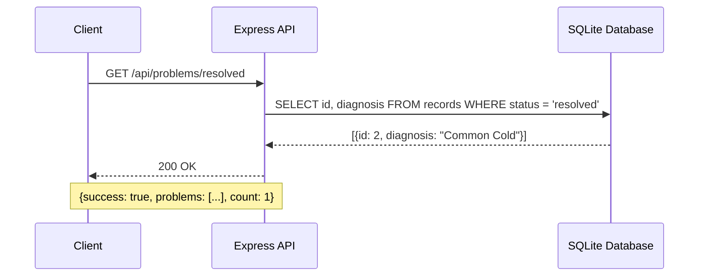
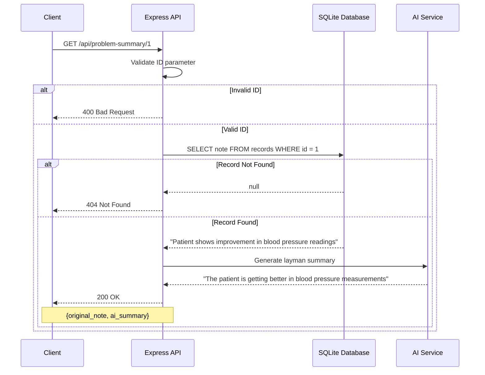
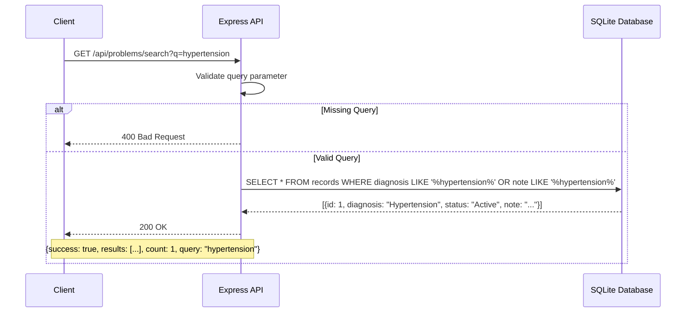
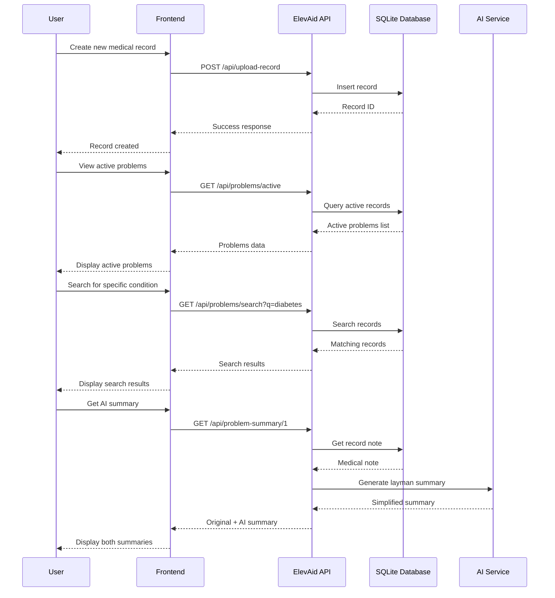
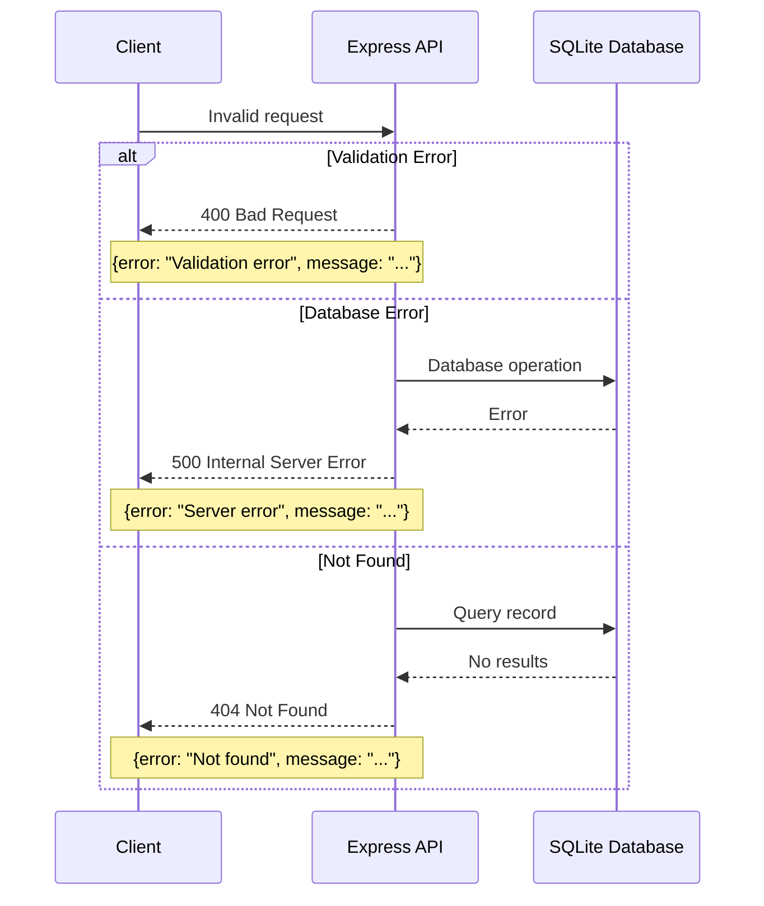
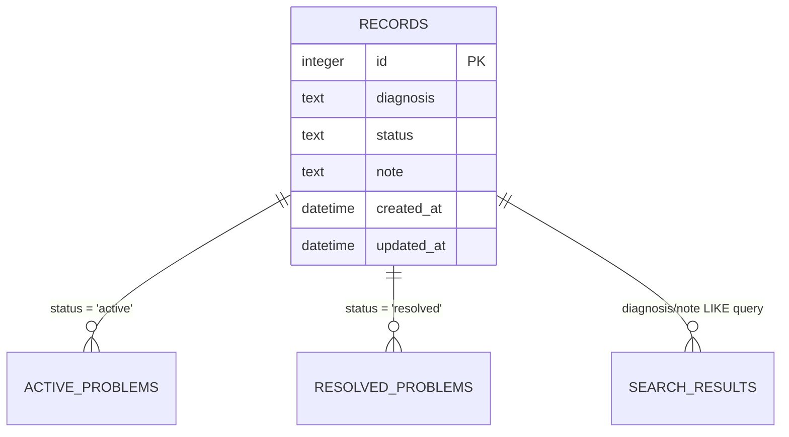
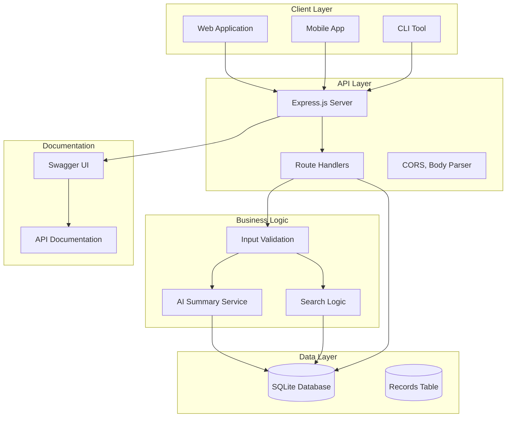
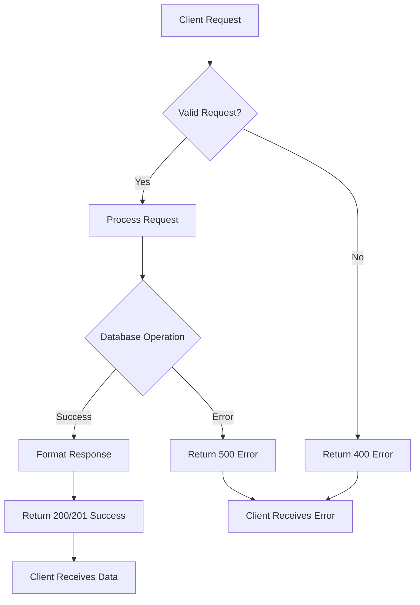

# ElevAid API - Sequence Diagrams

This document contains sequence diagrams showcasing the API flows for each endpoint in the ElevAid backend system.

## 1. Upload Record Flow

## 2. Get Active Problems Flow

## 3. Get Resolved Problems Flow

## 4. Problem Summary Flow

## 5. Search Problems Flow

## 6. Complete API Interaction Flow

## 7. Error Handling Flow

## 8. Database Schema Overview

## 9. API Architecture Overview

## 10. Request/Response Flow

---

## Notes

- All diagrams use **Mermaid** syntax for easy rendering in GitHub, GitLab, and other Markdown viewers
- Diagrams showcase both **happy path** and **error scenarios**
- The architecture follows **RESTful API** principles
- **Error handling** is consistent across all endpoints
- **Database operations** are optimized with prepared statements
- **AI integration** is modular and can be easily replaced with different providers

These diagrams provide a clear visual representation of how the ElevAid API handles different types of requests and interactions between system components. 